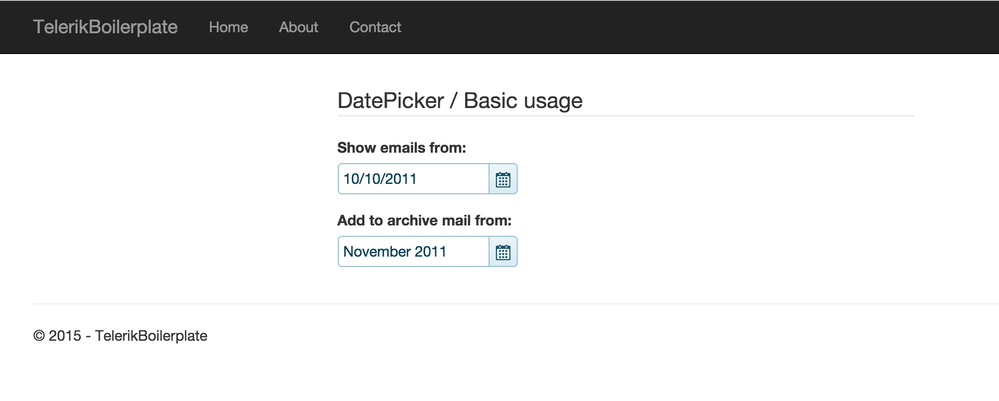

# An ASP.NET 5 MVC6 boilerplate for Kendo UI Core by Telerik

A boilerplate ASP.NET 5 MVC6 project based on Telerik's blog post: [Developing ASP.NET 5 Web Apps with Visual Studio Code](http://developer.telerik.com/featured/developing-asp-net-5-web-apps-with-visual-studio-code/)

This project uses `Kendo UI Core` library - instead of `Kendo UI` to avoid problems with installation for users that don't own full licensed version of `Kendo UI`.



Note: the ASP.NET 5 is in `beta` and Telerik's Kendo.MVC uses Razor imperative syntax instead of declarative, new syntax based on TagHelpers. This will probably change in future.

## Running up

The project is created and built with `beta6` of ASP.NET 5. You need `dnx` installed on your machine:

[ASP.NET5 Getting Started documentation](http://docs.asp.net/en/latest/getting-started/index.html)

In order to correctly install client side dependencies - including `Kendo UI Core` please make sure to run on the first installation all commands in following order:
```
dnu restore
```
This will install both ASP.NET5 and client side dependencies

```
dnu build
```
This will build your project and also client-side content. For example minification is performed on `build` event via `project.json` scripts.

```
dnx . kestrel
```

## Recap

These are differences and enhancement compared to original article:

* open source version of Telerik's library is used: `Kendo UI Core`
* `Bower` is used to install locally all dependencies
* CDN are used to link to used libraries with fallbacks to local content
* `Gulp` manages local dependencies and there is a task that optimizes which scripts are copied to `wwwroot` directory from `bower_components`
* the Razor sections are used for script and styles inclusion
* `Kendo UI Core` client side code is executed in deferred way


## Author

The original Telerik's post by [Lohith G N](http://developer.telerik.com/author/lohithgn/)

Rewritten/refactored:

@blazejewicz
